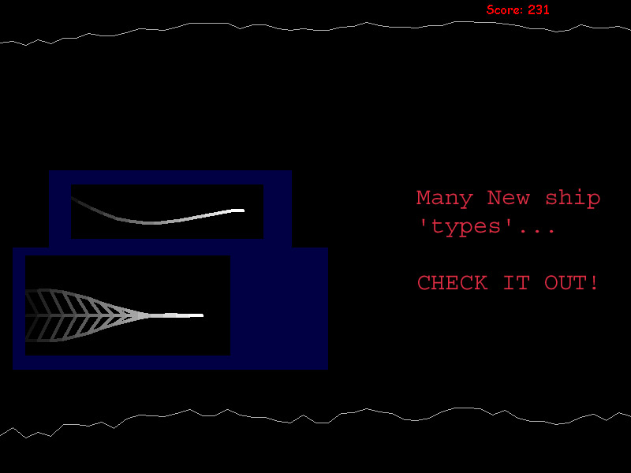



## jfCave \- Not quite so simple fun game \*UPDATE\*

### Description

That simple fun game is BACK with a VENGANCE!

***update*** - now has restart capability (w/o re-running application)

Simple sidescrolling flying thru a cave game. I remade it to use lines instead of the line control, so now the grafix dont flicker as you play.

new features added -

New ship types

Use 'lines' instead of hundreds of 'line' controls

'ship' controls updated

LOTS of configurable options

Normal/inverted (goofy) controls for extra challenge.

It's pretty much done, with the exception that I dont feel like programming an animation for the 'death' explosion right now...thats all thats lacking right now.

Votes are welcome but not demanded, feel free to comment with suggestions, etc.

YAHOO!
 
### More Info
 

             |
---                |---
**Submitted On**   |2002-08-28 01:08:10
**By**             |[Emperor Frollard](https://github.com/Planet-Source-Code/PSCIndex/blob/master/ByAuthor/emperor-frollard.md)
**Level**          |Intermediate
**User Rating**    |4.9 (74 globes from 15 users)
**Compatibility**  |VB 6\.0
**Category**       |[Games](https://github.com/Planet-Source-Code/PSCIndex/blob/master/ByCategory/games__1-38.md)
**World**          |[Visual Basic](https://github.com/Planet-Source-Code/PSCIndex/blob/master/ByWorld/visual-basic.md)
**Archive File**   |[jfCave\_\-\_N1234008282002\.zip](https://github.com/Planet-Source-Code/emperor-frollard-jfcave-not-quite-so-simple-fun-game-update__1-38395/archive/master.zip)

